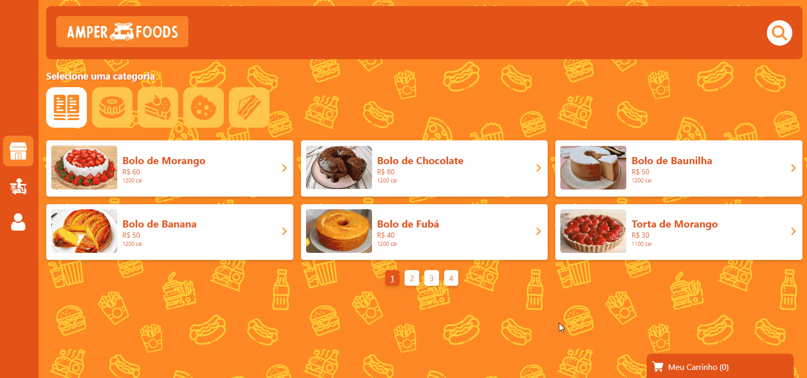
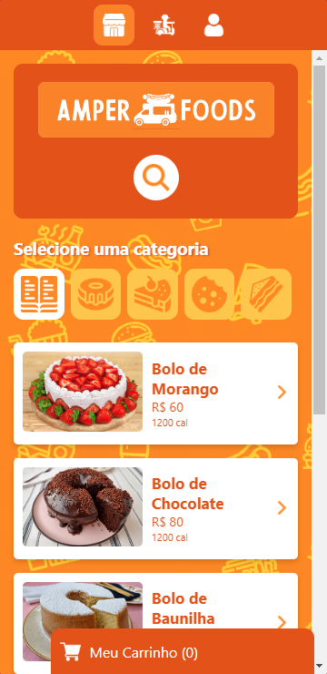

<h1 align="center">

</h1>

## 💻 Preview

    
    

## 🚀 Sobre o Projeto

Este projeto é uma aplicação web de delivery que contem as seguintes funcionalidades:

✔️ Registro de novo usuário.  
✔️ Login do usúario.  
✔️ Lupa para pesquisa de produtos específicos.  
✔️ Visualização de produtos por categoria.  
✔️ Modal para adicionar produtos ao carrinho.  
✔️ Carrinho de compras que deixa salvo os produtos adicionados mesmo depois de fechar o navegador.  
✔️ Modal para editar endereço antes de confirmar pedido.  
✔️ Página com histórico de pedidos.  
✔️ Opção de limpar histórico de pedidos.  
✔️ Página de informações do usuário.  
✔️ Possibilidade de alterar suas informações.  
✔️ Possibilidade de sair da conta.  
✔️ Possibilidade de deletar a conta
✔️A aplicação utiliza a biblioteca json-server que simula uma api rest para buscar os produtos e categorias.  
✔️A autenticação do usário é feita com Firebase aAthentication e os dados dos pedidos e dados do usuário ficam salvas no Firebase Datastore.

## 🚀 Tecnologias

Paro o desenvolvimento utilizei as seguintes tecnologias:
- [React](https://reactjs.org/)
- [TypeScript](https://www.typescriptlang.org/)
- [Styled-Components](https://styled-components.com/)
- [React hook form](https://react-hook-form.com/)
- [Zod](https://zod.dev/)
- [JSON Server](https://github.com/typicode/json-server)
- [Vite](https://vitejs.dev/)
- [Firebase](https://firebase.google.com/)

## Links
* Repositório: https://github.com/lucasgmaieski/AmperFoods
* Deploy: https://amper-foods.vercel.app/
 
 

Feito com 💜 by Lucas Maieski
